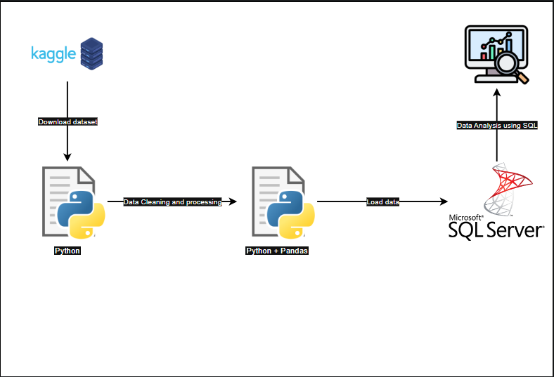

# Data Analysis Project 1
End to end Data Analytics Project usando Python y SQL

> Este proyecto es un ejercicio práctico de análisis de datos donde trabajé con un archivo .csv para explorar, limpiar, transformar y consultar información sobre pedidos de productos.
>> ## Herramientas utilizadas
>> - Python con librerías como:
>>   - Pandas para la manipulación de datos
>>   - Jupyter notebook para documentación y ejecución paso a paso
>> - SQL Server para cargar y consultar los datos con SQL
>> - Git & GitHub para el almacenamiento del proyecto
>> 
>> ## ¿Qué se hizo?
>> 1. Exploración inicial del archivo CSV
>> 2. Limpieza y transformación de los datos en Python para dejarlos listos para análisis
>> 3. Inserción de los datos en una base de datos relacional (MS SQL Server)
>> 4. Creación de consultas SQL para responder preguntas clave del negocio
>> 5. Todo el trabajo quedó dividido en dos archivos:
>>     - orders_data_analysis.ipynb – contiene el análisis y transformación con Python
>>     - SQL_Questions_Answer.sql – incluye las consultas realizadas a la tabla con los datos

# Project Diagram

